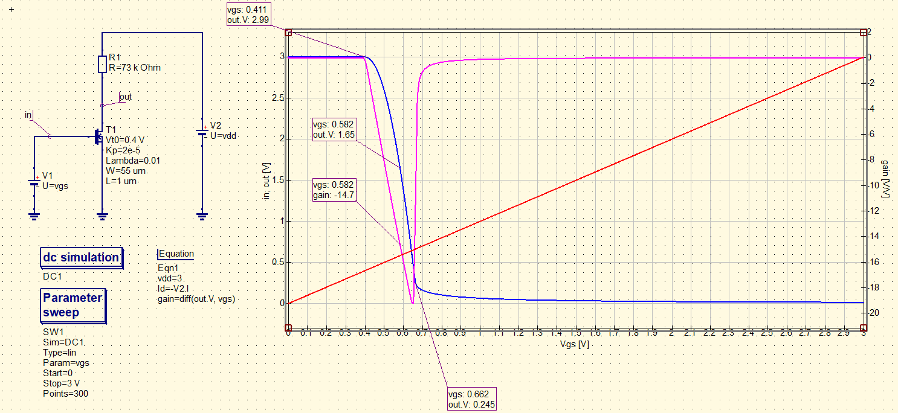
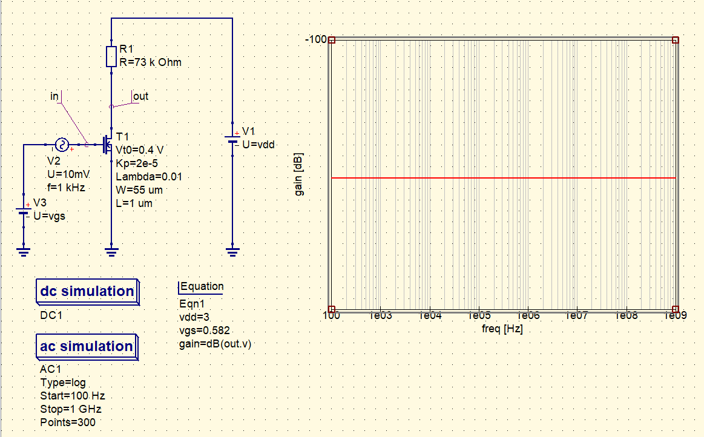
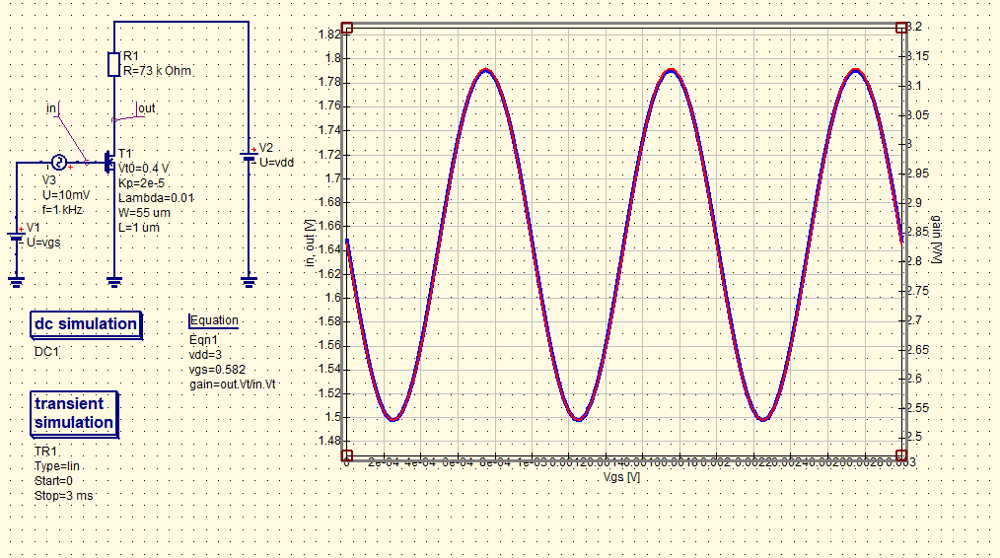

# Design simply CS amplifier

### Description of exercise

Design simply MOS amplifier in common source configuration with passive load and the gain of about 15 V / V. 
Vdd = 3 V, L = 1um, set the operating point to have output node at a level of about 1.7 V.
Determine the gain in DC (differentiate output voltage with respect to the input voltage), AC and TRAN analysis. Check the linear range of your amplifier.

## Solution

    

    

    

