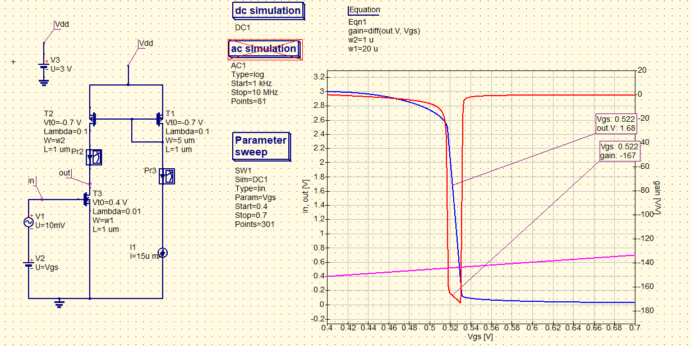
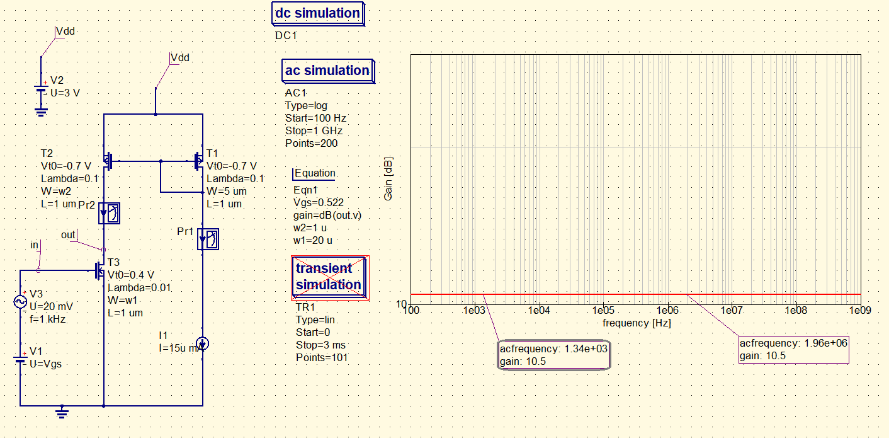
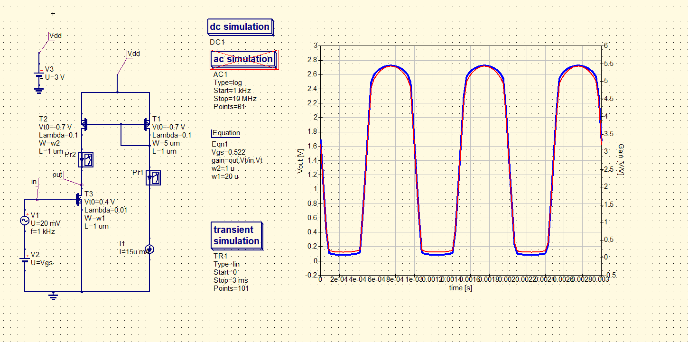

# Design CS amplifier with active load
 

### Description of exercise
In the amplifier from the last exercise change passive load to active load.

For the p-MOSFET  transistor set its parameters to:  Vt0 = -0.7,  Lambda = 0.1.
Vdd = 3 V, L = 1um (for all transistors), set the operating point to have output node at a level of about 1.7 V.
Determine the gain in DC (differentiate output voltage with respect to input voltage), AC and TRAN analysis .

## Solution

    

    

    

