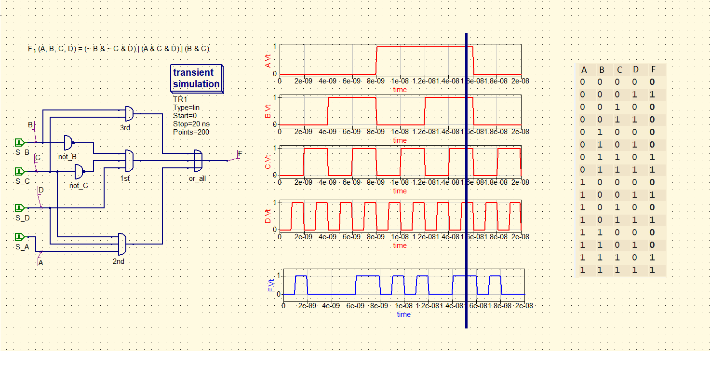
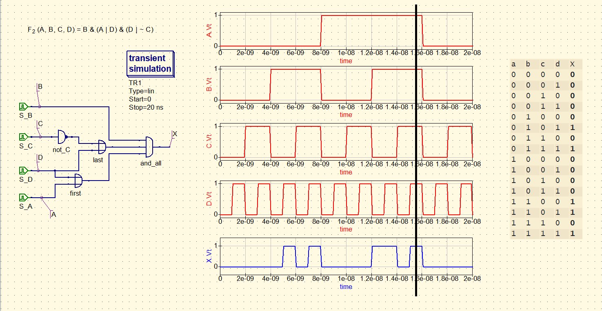

# Truth table

### Description of exercise

Symbols used in logical functions below:

~ is logical negation (NOT)
& is logical multiplication (AND)
| is logical sum (OR)

Draw a schematic and create a truth table (based on simulations) for both 4-input logical functions

F_{1}(A, B, C, D) = (~ B & ~ C & D) | (A & C & D) | (B & C)
F_{2}(A, B, C, D) = B & (A | D) & (D | ~ C)
In solution post a schematic and truth table of each function.

## Solution

    

    

