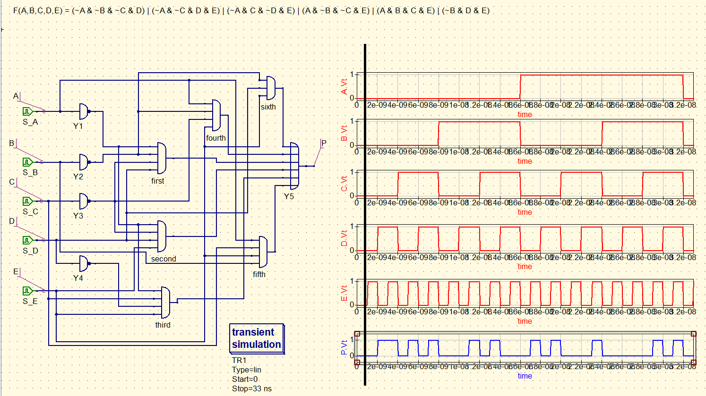

# Create a function which identifies primary numbers
 
### Description of exercise
Create 4-input logical function F (A, B, C, D) which identifies primary numbers, so if 4-bit number ABCD is a primary number the value of function is 1. In other cases it is 0.

You can gain 2 points (instead of 1) if your function has 5-bit input. This modification is only for ambitious students because it makes the problem quite difficult.  

## Solution

    

