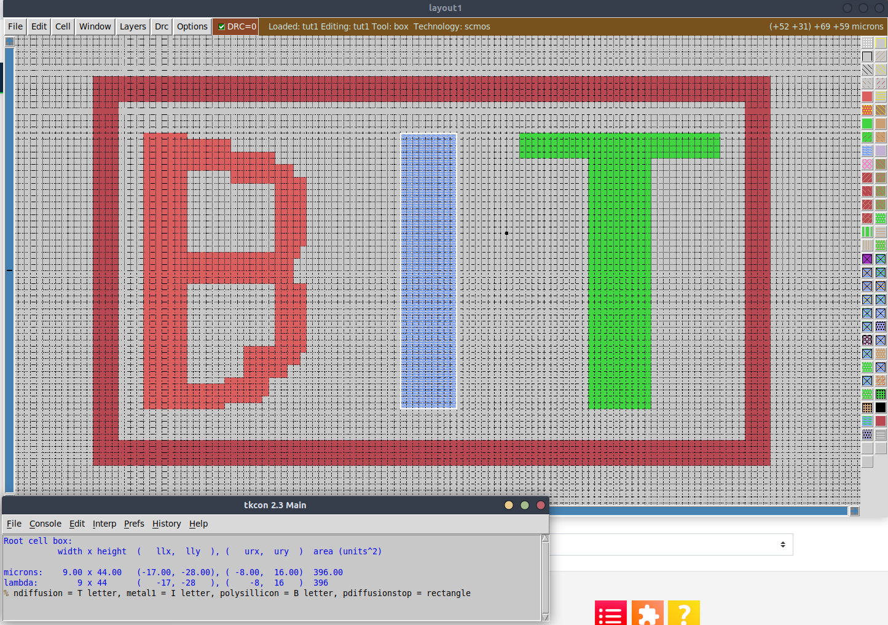

# Draw a logo

### Description of exercise
Draw a layout which consist of at least three letters e.g. AGH and surround them with a rectangle. Each letter is drawn with different layer e.g. poly (red layer), ndiff (green layer), metal1 (blue layer).  The rectangle should use another layer e.g. metal2, so in total you will use 4 (or more) layers in your drawing.

Letters should be large: at least 20 lambda in height. DRC errors (white dots) are not important.

## Solution

    

