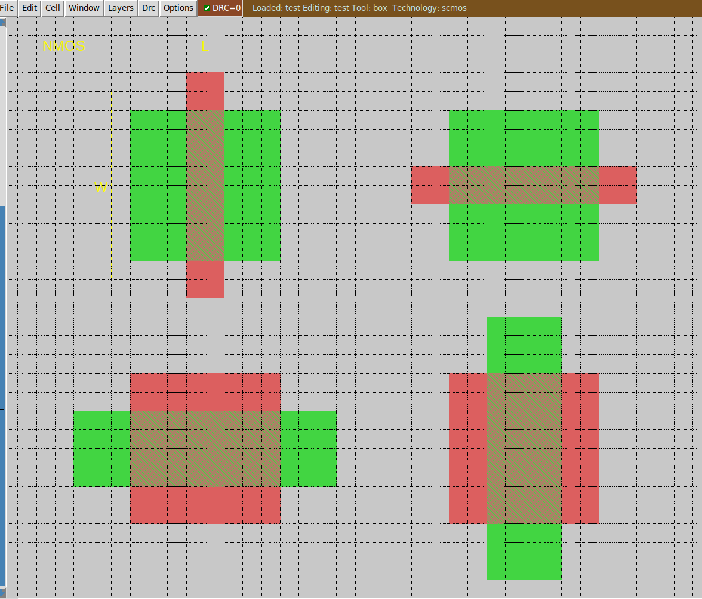
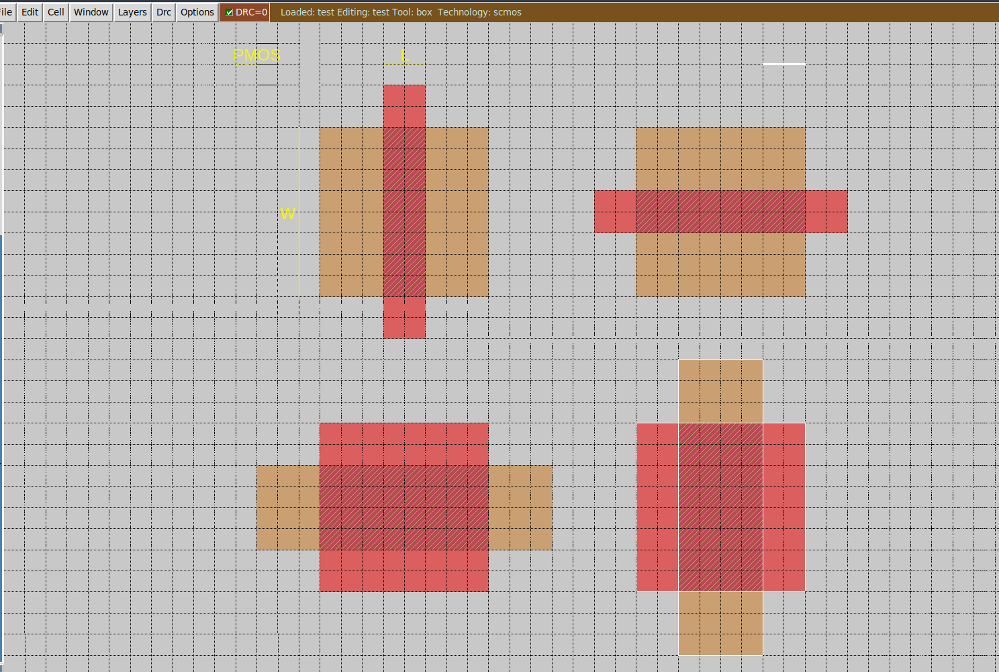

# Draw 8 transistors

### Description of exercise
First draw 4 n-type (NMOS) transistors. Each one should be different: in aspect ratio (W / L) or in orientation (horizontal / vertical).

2 transistors have W / L = 4 and the other two 0.5. One in the pair with the same W / L is oriented horizontally and the second vertically. As a result we have 4 different NMOS transistors.

Repeat the same with PMOS transistors, so in total there will be 8 different transistors in your layout.

Eliminate all DRC errors (white dots). Add large enough extension of poly, ndiff and pdiff in transistors. Separate transistors.

## Solution

    

    

