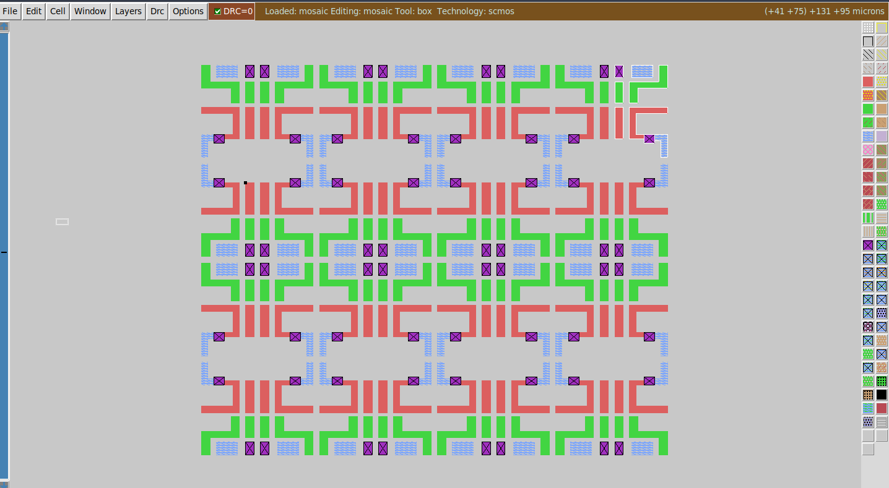

# Make a mosaic

### Description of exercise
Start from tut2b. Make some stretching in layers. Make this cell more compact etc. Eliminate all DRC errors during modifications.

Copy, flip & rotate the cell after modifications to make a mosaic of size at least 4x8.

Adjacent "cells" should be flipped horizontally ( sideways ) and vertically ( upsidedown ).
Layout should be flat ie no hierarchy. All shapes are located in single cell.

## Solution

    

