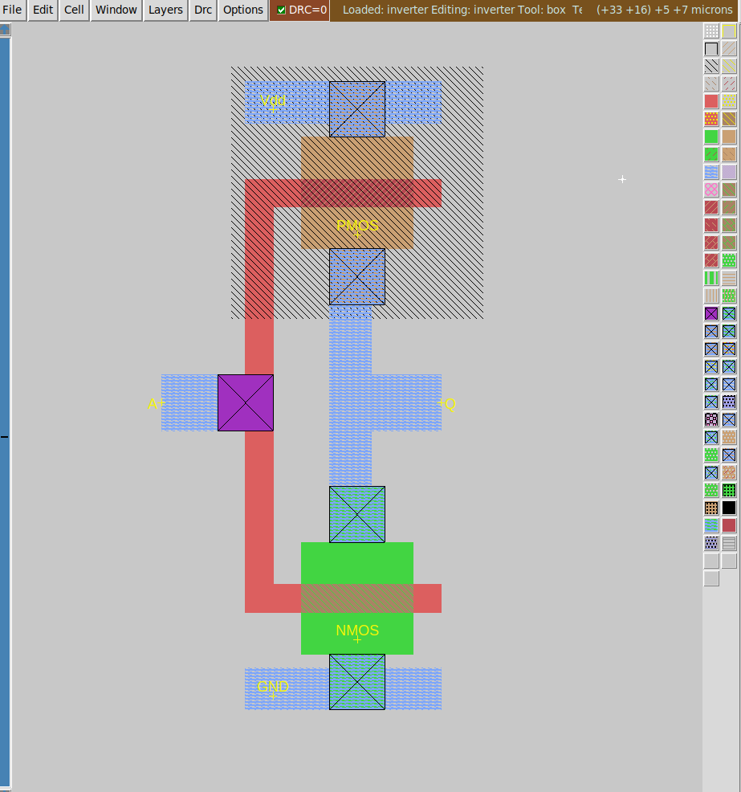

# Draw an inverter

### Description of exercise
Draw a layout of inverter. Use a layout which is located at the end of tutorial 2 (right side) as starting point. 

At the beginning create a new cell Menu->Cell->New ... 
- Map the structure of the layout and make elements large enough to avoid DRC errors.
- Connect gates of both transistors NMOS and PMOS together using poly layer. Change a layer to metal1 (using polycontact) and label it "A".
- Connect drains of transistors together. Use contacts (ndcontact for NMOS & pdcontact for PMOS) to change layer to metal 1 then connect   contacts with metal1 and label it "Q"
- Draw supply rails (lines) at top and bottom and label them "Vdd!" and "Gnd!"

## Solution

    

