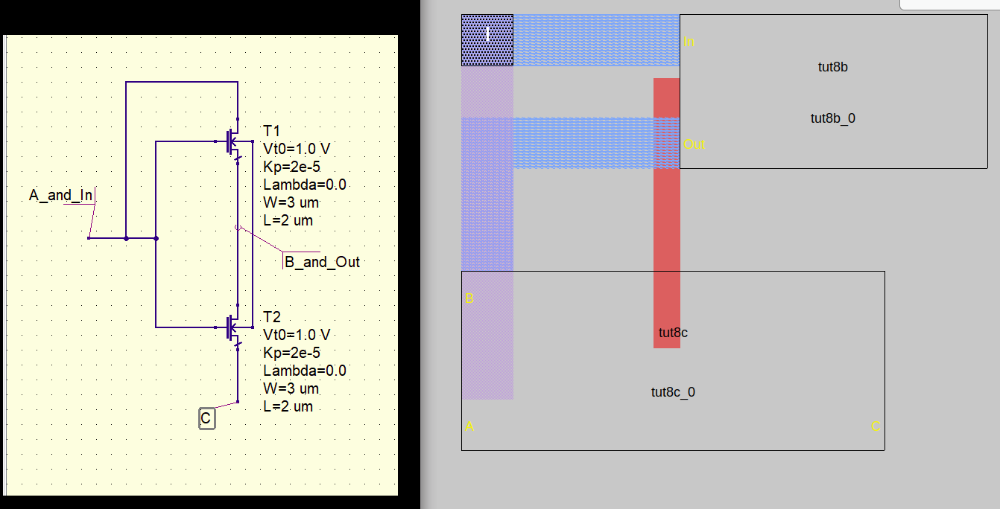

# Analyze layout and draw its schematic

### Description of exercise
Analyze hierarchical layout of cell tut8a and draw its schematic.

- Remove hierarchy from the schematic, it should be flat.
- Measure sizes of transistors and show them in schematic.
- Use label names present in layout to name the nets in schematic.

## Solution

    

