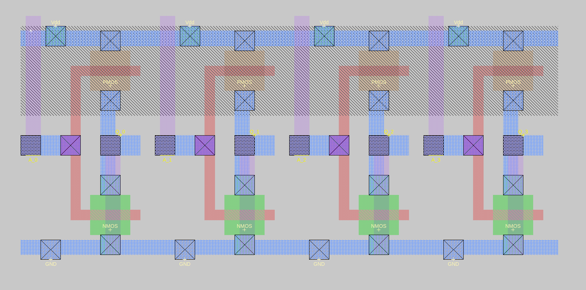

# Draw a 4-bit inverter block

### Description of exercise
It may be good idea to train first part of Tutorial #3: Advanced Painting (all without plowing) before doing this exercise.

Prerequisite. In this exercise you will need inverter from Exercise 18 (Simple circuit), so you have to finish it first.

You should add two new objects to your inverter the substrate contacts. Although both B terminals of inverter transistors are already connected to p-type substrate (n-mos) or to n-well (p-mos), the substrate and n-well themselves are not connected to any voltage. As a result the B terminals are in fact dangling. We should correct this.

In digital circuits typically substrate is connected to Gnd! and n-well to Vdd! which are the lowest and the highest voltage potential in the circuit. In Magic there are two special layers for doing this psubstratepcontact (for p type substrate, so n-mos transistor) and nsubstratencontact (for n type well, so p-mos transistor). 

Auto-increment (also auto-decrement) function is described in section Labels of Tutorial 2: Basic Painting and Selection.

## Solution

    

