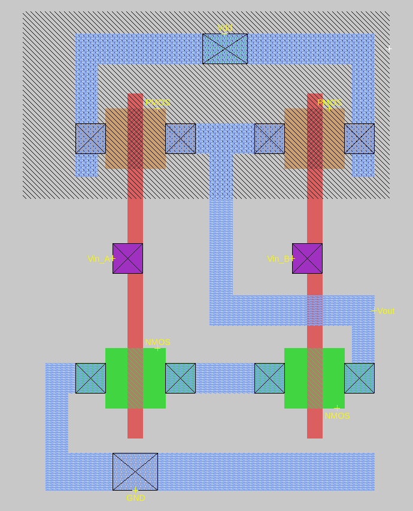

# Draw a NAND gate

### Description of exercise

Draw a NAND gate according to movie. 

Don't forget about n-well around p-mos transistors and at least one substrate and one well contacts.
Label all inputs, output and supplies.

## Solution

    

