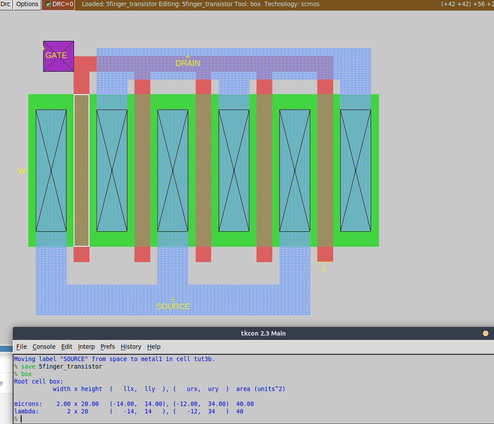

# Draw multi-finger transistor

### Description of exercise

Draw multi-finger transistor of size W / L = 100u / 2u:

- Divide transistors for 5 fingers (elements).
- Label terminals: Gate, Source, Drain.
- In solution show screenshot without grid and attach magic file (.mag) with the design.

## Solution

    

