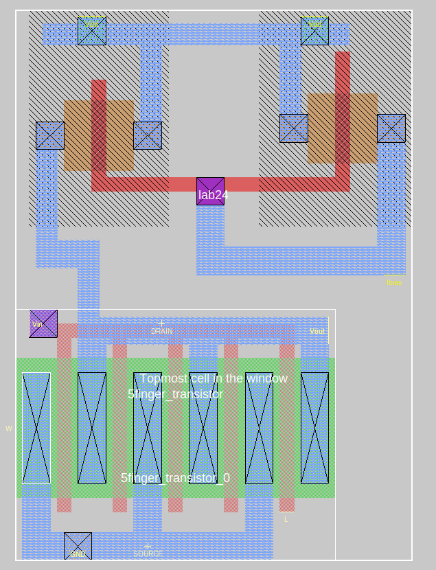

# Perform TRAN simulation

### Description of exercise

Draw layout of amplifier with active load from schematic above:

- scale transistors sizes to SCMOS technology,
- use cell from Exercise 23 (Multi-finger transistor) and create hierarchical layout,
- label input, output, biasing current and supplies,
- in solution show layout without grid and attach both magic files (.mag) ie the top cell and sub cell.

## Solution

    

