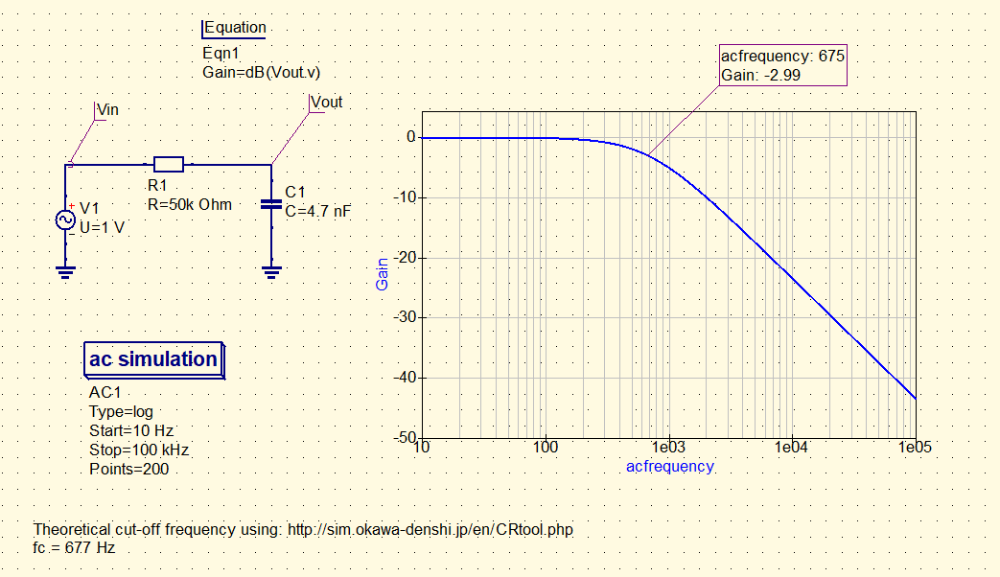

# Perform AC simulation

### Description of exercise

For a simple RC passive filter, perform a simulation to determine its cutoff 3dB frequency. Please demonstrate the result in the form of a graph with a marke r on it.
  
<b> Note </b> : please draw the graph with a logarithmic scale, the filter response should be expressed in dB (use Equation ).

 

    

