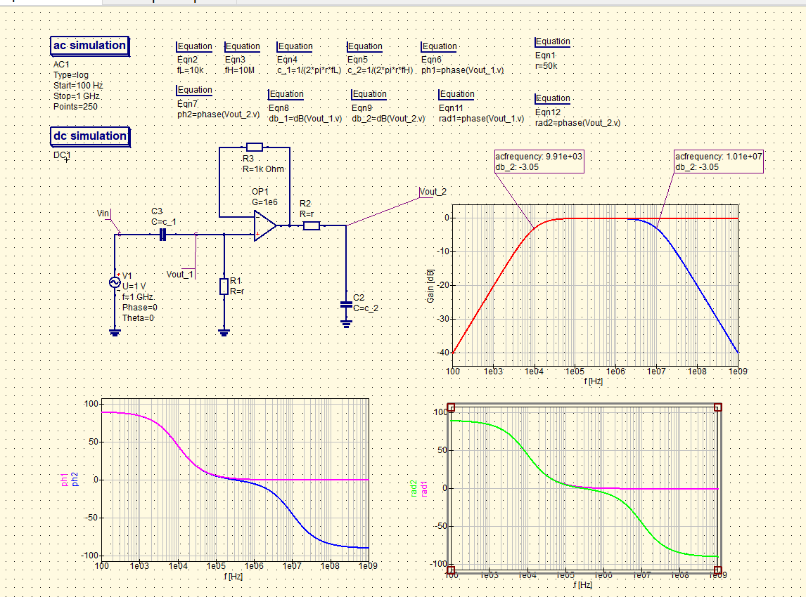

# Design 1st order bandpass filter

### Description of exercise

Design 1st order bandpass filter: low cutoff frequency 10kHz, high cutoff frequency 10MHz.
  
<b>Notes</b> : Attach both Bode plots. Horizontal axes please label frequency [Hz] , vertical axes gain [dB] and phase respectively. Determine the phase in degrees and radians.

  

## Solution

    

