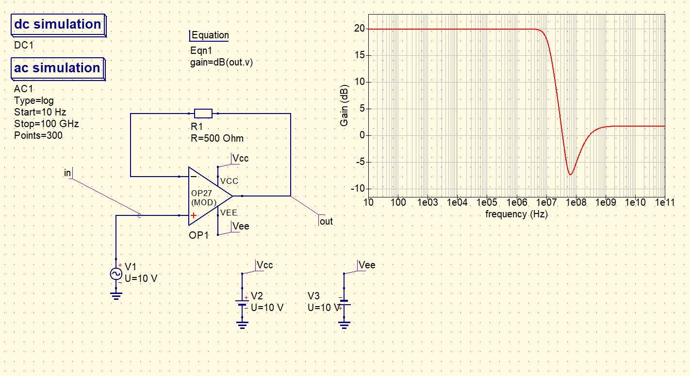
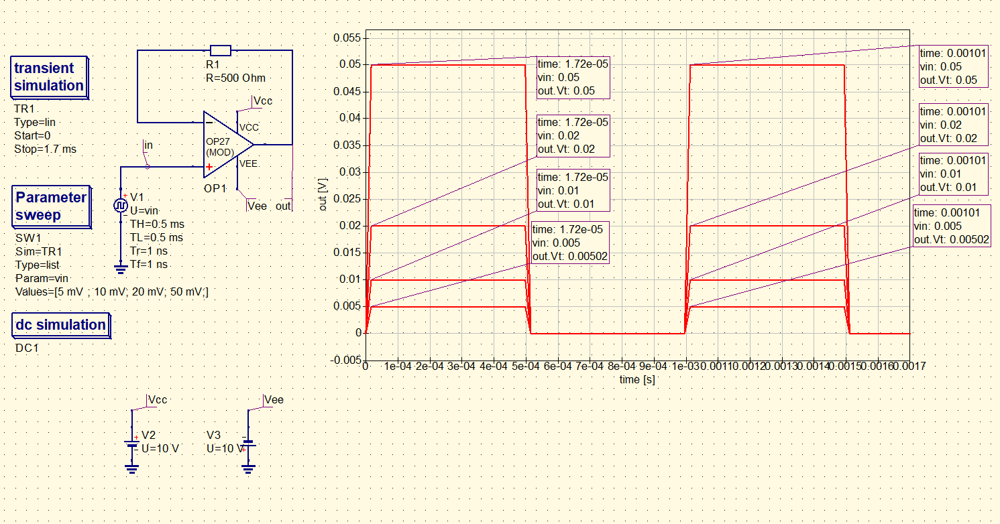

# Check performance of OP27 operational amplifier

### Description of exercise
Perform simulations to check performance of the model of  OP27 operational amplifier available in the OpAmps library - op27 (mod) :

- check the gain of unity gain amplifier,
- check the amplifier's frequency response (GBW),
- check the response limitation due to the supply voltage and the slew rate.
  
Attach plot with input and output signals. 
  

## Solution

    

    

    

