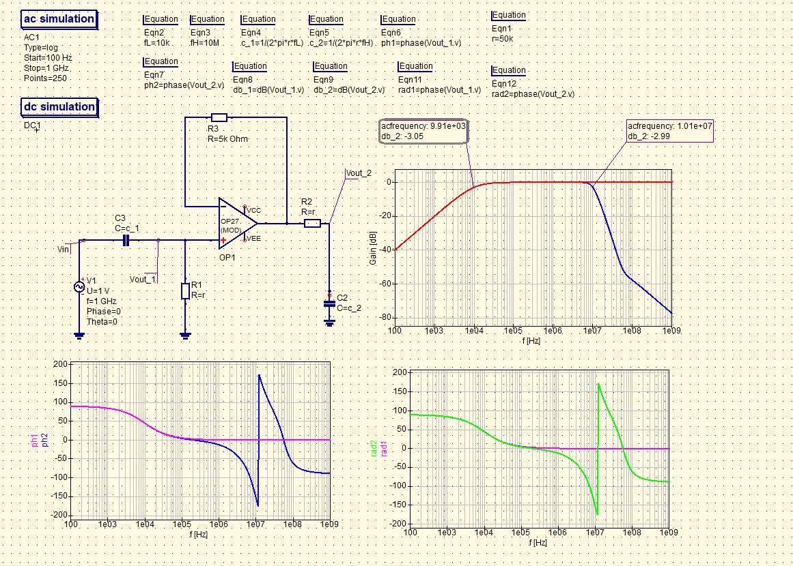

# Design 1st order bandpass filter with OP27 based buffer

### Description of exercise
Design 1st order bandpass filter using OP27 as a buffer: low cutoff frequency 10kHz, high cutoff frequency 10MHz.

## Solution

    

