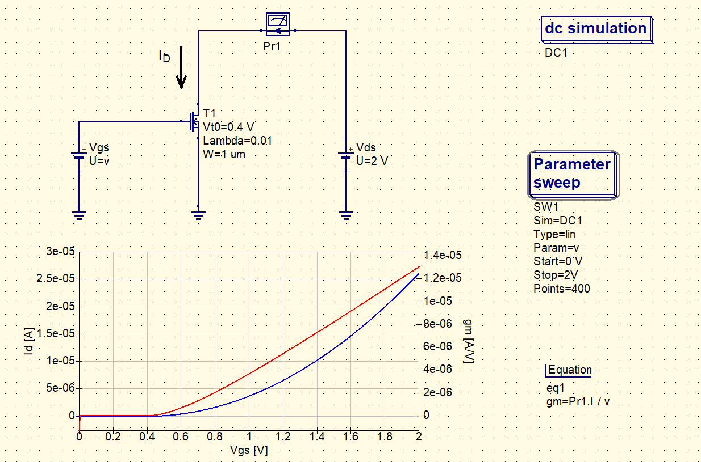
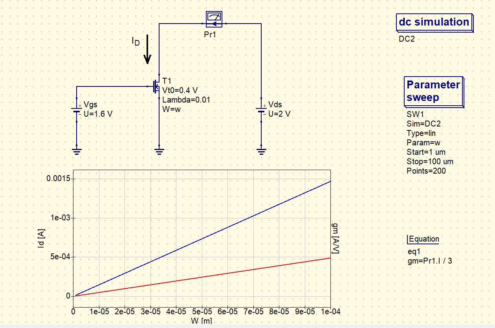

# Determine Id vs. Vgs characteristics  

### Description of exercise
Determine Id (drain current) vs. Vgs (gate-source voltage) characteristics for n-MOS transistor.

Take the  n-MOSFET  transistor from the  Components  Library and set its parameters: Vt0 to 0.4, Lambda to 0.01. Perform the simulation for Vds = 2V (drain-source voltage). Sweep Vgs from 0 to 2V.
Determine gm (transonductance) of the transistor (differantiate Id with respect to Vgs).
 

Check the characteristics for different W (from 1um to 100um).
 

Attach only one plot. Label x-axis as Vgs [V], left axis as Id [A] and right axis as gm [A / V].

## Solution

    

    

